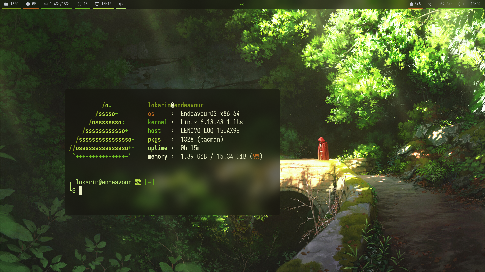
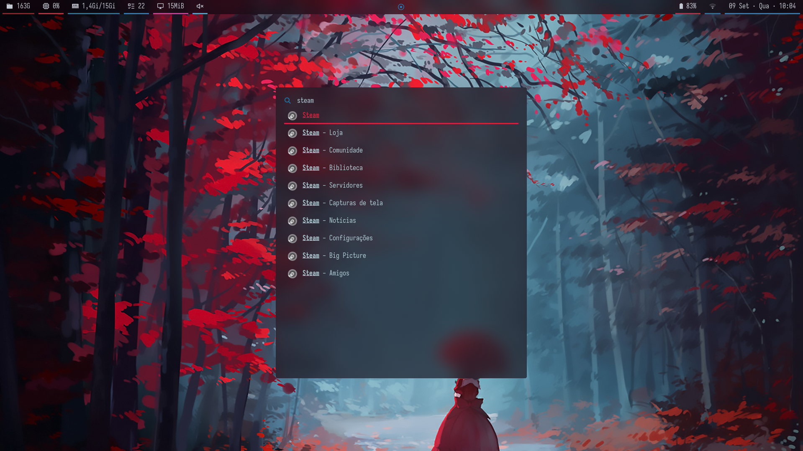
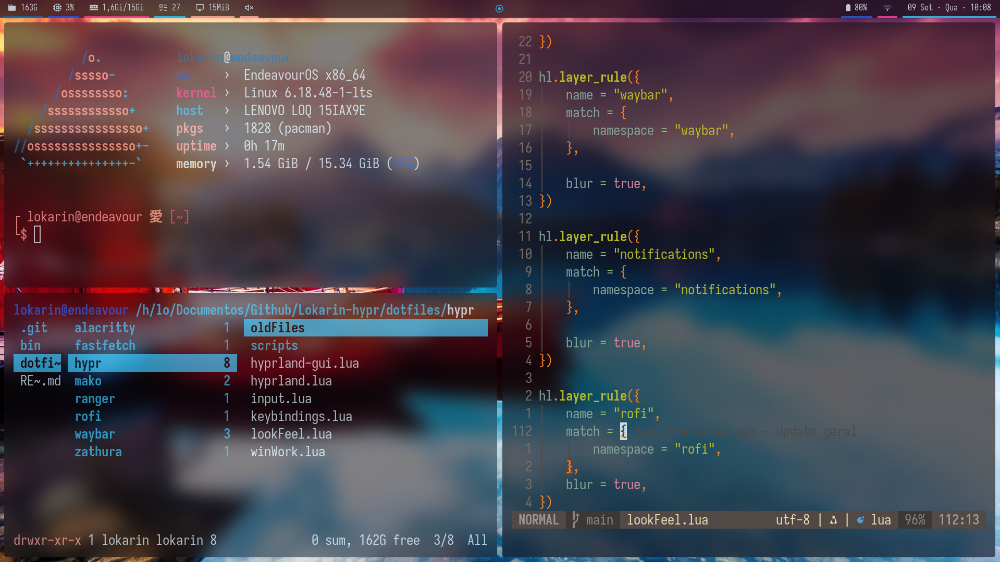
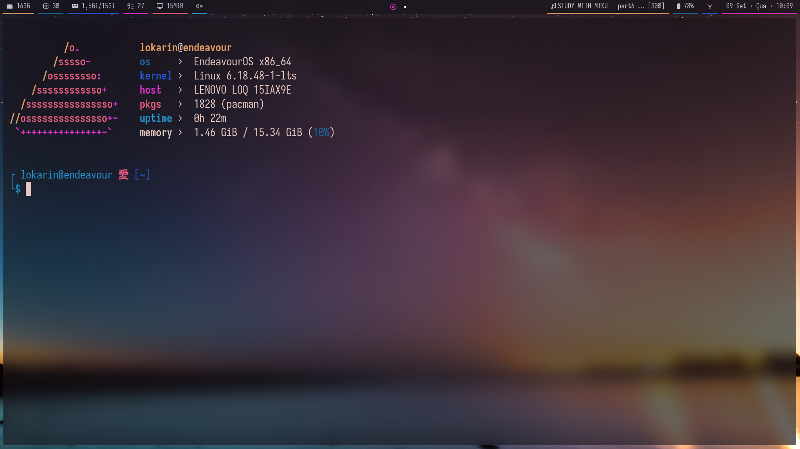

# Hyprland Rice

My personal Hyprland rice running on EndeavourOS.

The setup focuses on a clean and minimal interface, with dynamic colors, transparency, blur effects and custom scripts integrated throughout the desktop environment.

## 🖼️ Preview

<div align="center">
  
  
  <br>
  
  
</div>

## ✨ Cool Things

* Hyprland with modular Lua configuration
* Waybar with custom modules and scripts
* Rofi as application launcher
* Alacritty terminal
* Mako notifications
* `awww` for animated wallpaper transitions
* Pywal for dynamic color generation
* Iosevka Nerd Font
* Custom shell scripts and utilities

## 🖥️ Environment

| Component      | Software          |
| -------------- | ----------------- |
| OS             | EndeavourOS       |
| Window Manager | Hyprland          |
| Status Bar     | Waybar            |
| Launcher       | Rofi              |
| Terminal       | Alacritty         |
| Notifications  | Mako              |
| Wallpaper      | awww              |
| Color Scheme   | Pywal             |
| Font           | Iosevka Nerd Font |
| File Manager   | Ranger            |

## 📁 Repository Structure

```text
.
├── bin/                # Personal utility scripts
├── dotfiles/           # Configuration files
│   ├── alacritty/
│   ├── fastfetch/
│   ├── hypr/
│   ├── mako/
│   ├── ranger/
│   ├── rofi/
│   ├── waybar/
│   └── zathura/
├── img/                # Screenshots
└── README.md
```

### `bin/`

Contains personal utilities used throughout the environment.

Some of the scripts include:

* `setWal` — wallpaper and color scheme management
* `diaNoite` — day/night configuration
* `pywaltic` — Pywal-related utilities
* `cmusWal` — integration between Pywal and cmus
* `gpuMode` — GPU mode management
* `navegadores` — browser-related utilities
* `logout` — session logout utility
* `downloadmp3` — MP3 download utility
* `compressor` — compression utility

### `dotfiles/`

Contains the configuration files for the applications used by the desktop environment.

#### Hyprland

The Hyprland configuration is split into several Lua files:

```text
hypr/
├── hyprland.lua
├── hyprland-gui.lua
├── input.lua
├── keybindings.lua
├── lookFeel.lua
└── winWork.lua
```

This keeps the configuration separated by functionality instead of maintaining a single large configuration file.

#### Waybar

Waybar contains custom modules, styling and scripts:

```text
waybar/
├── config.jsonc
├── style.css
└── scripts/
    └── cpu.sh
```

The additional scripts used by Waybar can be found in my myBashScripts repository.

#### Mako

Mako is configured with Pywal integration through:

```text
mako/
├── config
└── launchMako.sh
```

#### Rofi

The Rofi configuration is stored in:

```text
rofi/config.rasi
```

## 🎨 Theming

The rice uses **Pywal** to generate colors dynamically from the current wallpaper.

These colors are integrated into several parts of the desktop environment, allowing components such as Waybar, Mako and other applications to share a consistent color palette.

Wallpaper management is handled by `awww`, including animated transitions when changing wallpapers.

## 📜 License

This configuration is primarily a personal collection of dotfiles and scripts.

Feel free to use, modify and adapt it for your own setup.

